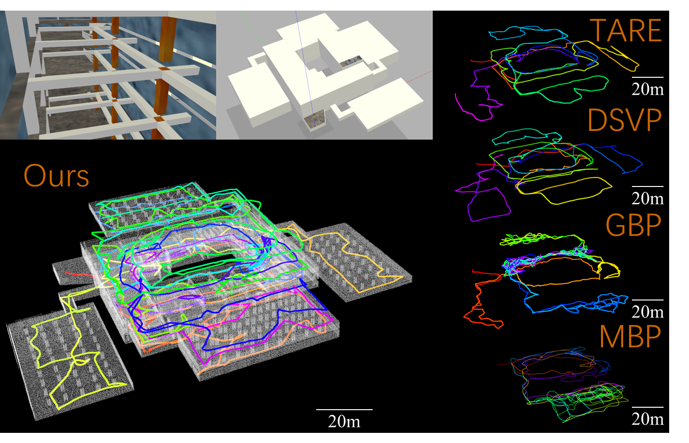
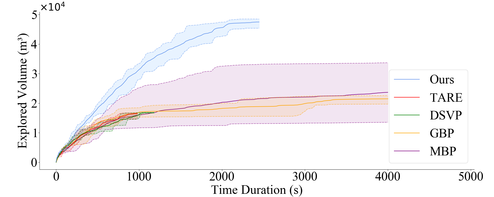
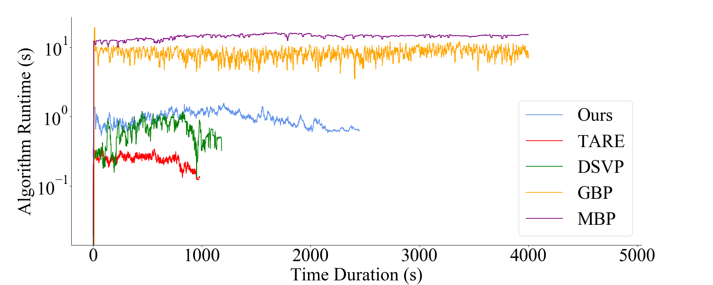
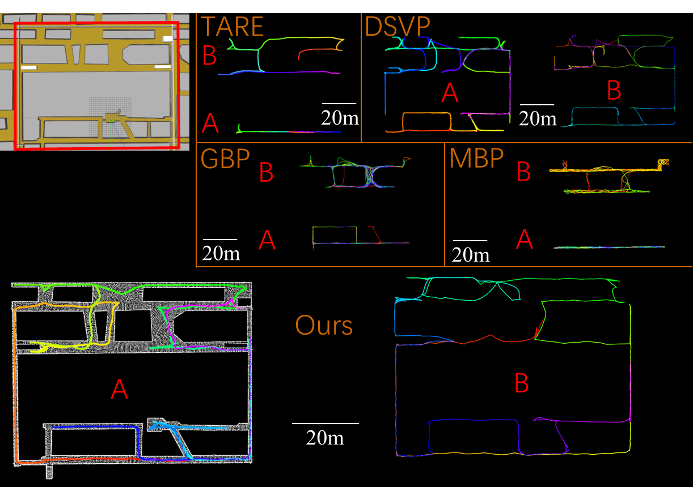
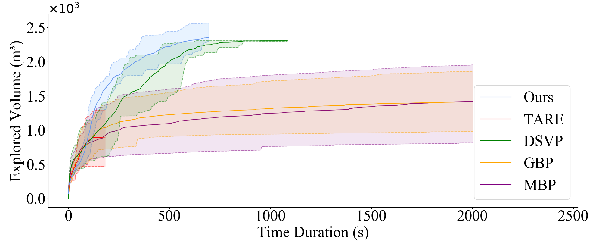
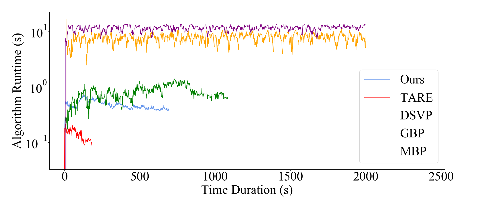
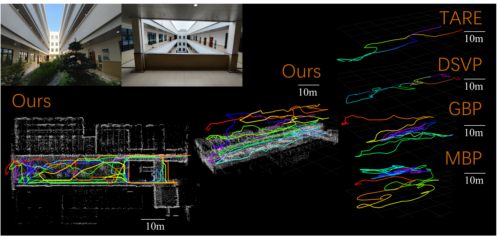
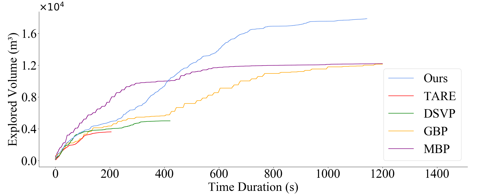
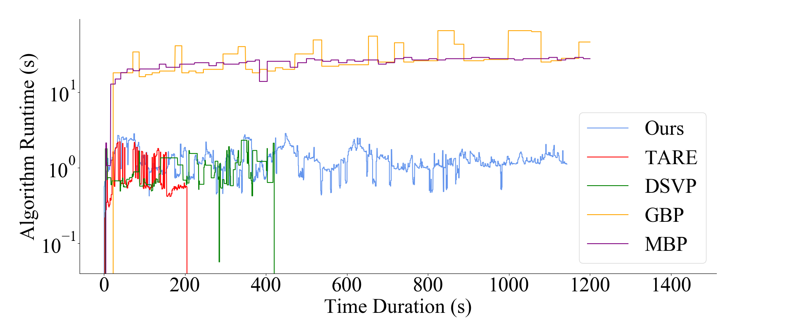

# code_planner
The paper "CODE: Complete Coverage UAV Exploration Planner using Dual-Type Viewpoints for Multi-Layer Complex Environments" is currently under submission to the RA-L journal.  
The source code of code-planner will be soon available.  

## Expeiments Videos  
We have designed several experimental evironments to validate the capability of our method. Updates are ongoing.  
  
Experiment ① "Narrow Tunnel": https://youtu.be/jENgJ3dgBa0 or https://www.bilibili.com/video/BV1h18YejEWP/    
Experiment ② "Narrow Tunnel: DSVP VS CODE": https://www.youtube.com/watch?v=VOSmzPwXvmc or https://www.bilibili.com/video/BV1vMvKesEBz/  
Experiment ③ "Garage"       : https://www.youtube.com/watch?v=5gJdlG9kfTY or https://www.bilibili.com/video/BV14DeZe9Ev3/
## Comparison between 2D and 3D exploration tasks
https://youtu.be/98l-RHV5oCA
## Requirement
Ubuntu20.04  
Ros2 Foxy
## Simulation environment  
①Garage-D garage with part of it's driveway destoryed: https://github.com/ssssuxin/autonomous_navigation_environment_ego  
②narrow tunnel: https://github.com/ssssuxin/autonomous_navigation_environment_ros1  

## Usages  
Please follow step "Simulation environment" to install experimental environments first.
### Garage  
in env_ego  

    ros2 launch ego_planner uav_new_garage.launch.py  
    ros2 launch visualization_tools visualization_tools.launch.py  
    (这里visualization_tools.launch.py需要解注释才能用，后续再传一个上去)  
in planner  

    ros2 launch uav_planner 5_21_new_garage_invalid.launch.py  
### Narrow Tunnel  
in env_ros1  

    roslaunch vehicle_simulator narrow_tunnel.launch  
in env_ego  

    ros2 launch visualization_tools visualization_tools.launch.py   
in planner  

    ros2 launch uav_planner explore_tunnel_5_20_guv.launch.py 
in a new terminate  

    souce /opt/ros/noetic/setup.bash
    souce /opt/ros/foxy/setup.bash
    ros2 run ros1_bridge dynamic_bridge   
note: you cloud install ros1_bridge by apt-get or https://github.com/ros2/ros1_bridge

## Results of Tests
### Test 1

  

     

CODE                                TARE

  

### Test 2

  

  

### Test 3

  

     

  

<!---

  

  

  

  

  

--->

## DATA Rigor
Please check the data statistics for comparing experiments, including exploration volume, time cost, etc., in the directory "t_distribution_for_datarigor".

  

